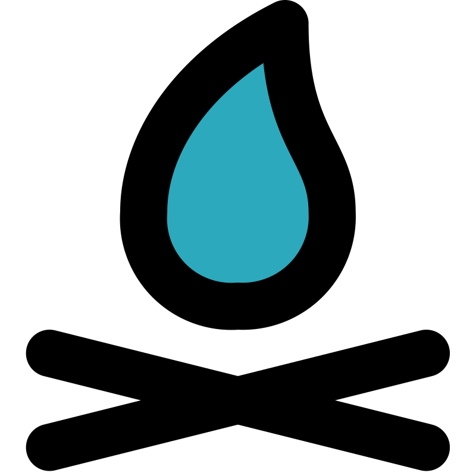

<h1 align="center" >
    
    ReCodeCamp - API
</h1>

    

---

> API for [github.com/jazicorn/recodecamp](https://github.com/jazicorn/recodecamp)

## About

[recodecamp.com](https://recodecamp-web.vercel.app/) helps your study and learn programing fundamentals. This repository contains the API utilized for the website.

Test API endpoints on [recodecamp.readme.io](https://recodecamp.readme.io/)

## Features

...

---

## Getting Started

...

### [Project Structure](/ARCHITECTURE.md)

...

### Requirements

...

### Installation

...

---

## Troubleshooting

...

## FAQ

...

---

#### [LICENSE](LICENSE.md)

<!-- Unused Badges -->
<!--
[Redis](https://img.shields.io/badge/redis-%23DD0031.svg?&style=for-the-badge&logo=redis&logoColor=white)
[RabbitMQ](https://img.shields.io/badge/rabbitmq-%23FF6600.svg?&style=for-the-badge&logo=rabbitmq&logoColor=white)
[Axois](https://img.shields.io/badge/axios-671ddf?&style=for-the-badge&logo=axios&logoColor=white)
[Postman](https://img.shields.io/badge/Postman-FF6C37?style=for-the-badge&logo=Postman&logoColor=white)
[Javascript](https://img.shields.io/badge/JavaScript-323330?style=for-the-badge&logo=javascript&logoColor=F7DF1E)
[Typescript](https://img.shields.io/badge/TypeScript-007ACC?style=for-the-badge&logo=typescript&logoColor=white)
[Codemirror](https://img.shields.io/badge/CodeMirror-D30707?style=for-the-badge&logo=CodeMirror&logoColor=white)
>
